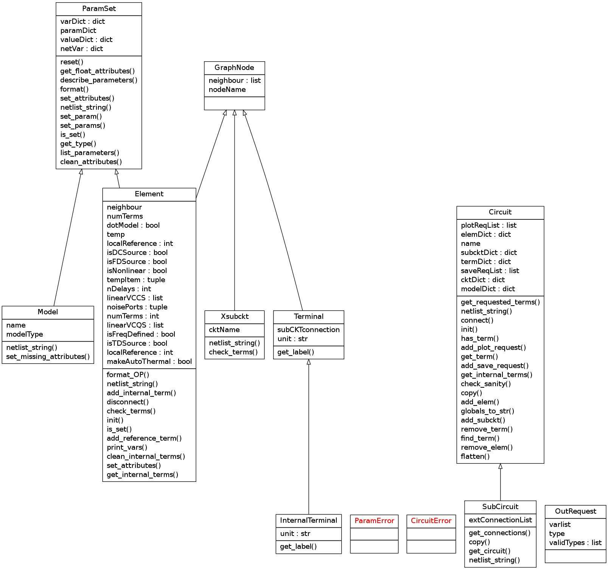

=========================================
Internal Circuit Representation Reference
=========================================

This document covers only how a circuit is represented after a netlist
is parsed. This representation attempts to be independent of how the
circuit is analyzed. Any specific analysis approach should be
implemented separately in the ``analysis`` package.

UML Class Diagram
-----------------

All device model classes are derived from the ``Element`` class.

Modules and classes
-------------------

.. automodule:: cardoon.circuit
       :members:

.. automodule:: cardoon.paramset
       :members:

.. automodule:: cardoon.globalVars
       :members:

.. automodule:: cardoon.devices
       :members:

UML diagrams generated using pyreverse (http://www.logilab.org/2560)
