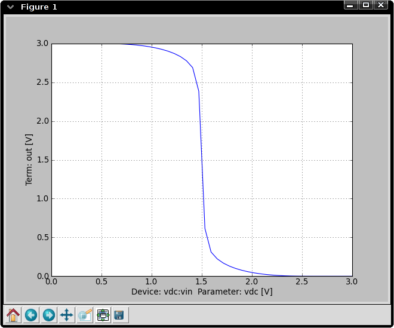
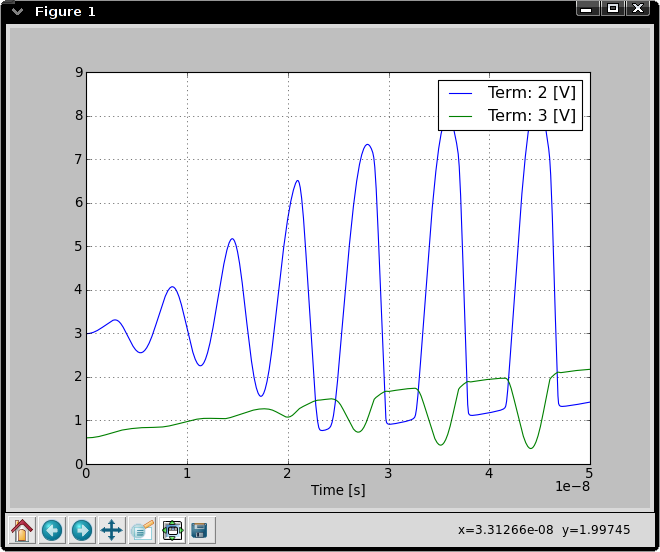
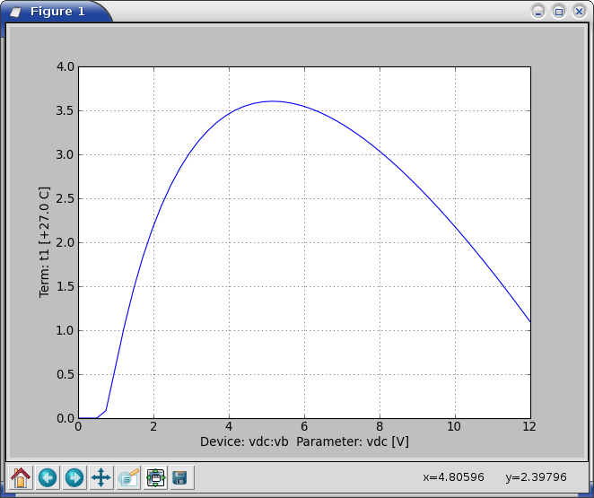
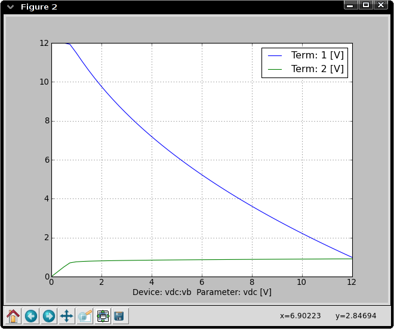
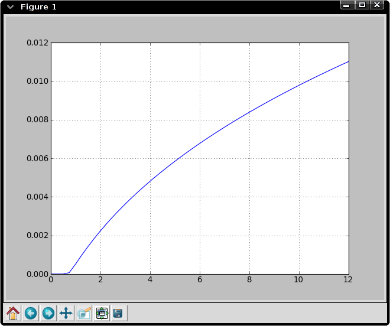
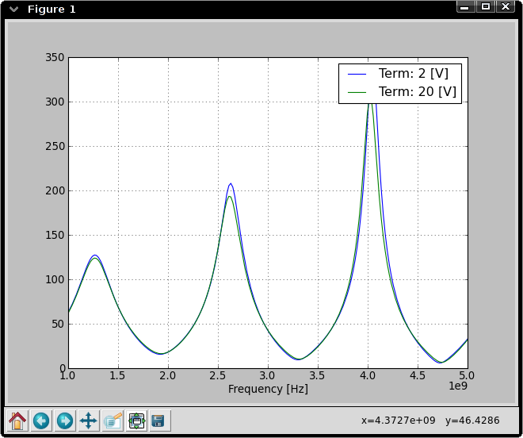
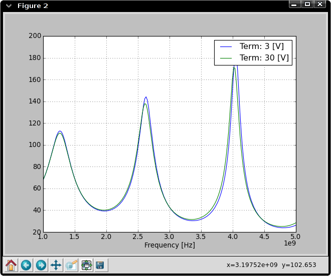

===================
Simulation Examples
===================

The following examples give an idea of the current simulator
capabilities shortly after version 0.3.dev. Some of these results may
change as errors are discovered and fixed or new capabilities are
added.

DC Sweep of CMOS Inverter
-------------------------

The netlist is the following::

    # CMOS inverter DC Sweep
    
    .analysis dc device=vdc:vin param=vdc start=0 stop=3V 
    
    vdc:vdd 1 gnd vdc=3V 
    vdc:vin in gnd vdc=1 
    
    x1 in out 1 gnd inverter
    
    .subckt inverter in out 1 gnd
    mosekv:m1 out in 1 1 type = p
    mosekv:m2 out in gnd gnd type = n
    .ends
    
    .plot dc out
    
    .end

Running this netlist produces the following output::

    cechrist@phobos:~/src/cardoon/test$ cardoon inverter.net
    ******************************************************
                     DC sweep analysis
    ******************************************************
    
     # CMOS inverter DC Sweep 
    
    Average iterations: 4
    Average residual: 1.64815116274e-09

The output plot of the inverter's output voltage is shown below.

BJT Colpitts Oscillator Transient Analysis
------------------------------------------

Netlist::

    ### BJT Colpitts Oscillator ###
    
    # Voltage supply: use a pulse to start oscillator
    vpulse:vs 1 0 v1=3 v2=11 tr=10ns
    
    res:rc 1 2 r=2.4e3
    cap:c1 2 0 c=2e-12
    ind:l1 2 5 l=1e-6
    cap:c2 5 0 c=2e-12
    res:re 4 0 r=1.3e3
    cap:ce 4 0 c=100e-12
    bjt:q1 2 3 4 model=t122
    res:r1 1 3 r=8e3
    res:r2 3 0 r=2e3
    cap:cc 5 3 c=400e-12
    
    .model t122 bjt (type=npn isat=0.480e-15 nf=1.008 \
    bf=99.655 vaf=90.000 ikf=0.190 \
    ise=7.490e-15 ne=1.762 nr=1.010 br=38.400 var=7.000 ikr=93.200e-3 \
    isc=0.200e-15 nc=1.042 rb=1.500 irb=0.100e-3 rbm=1.200 cje=1.325e-12 \
    vje=0.700 mje=0.220 fc=0.890 cjc=1.050e-12 vjc=0.610 mjc=0.240 xcjc=0.400 \
    tf=56.940e-12 tr=1.000e-9 xtf=68.398 vtf=0.600 itf=0.700 xtb=1.600 \
    eg=1.110 xti=3.000 re=0.500 rc=2.680)
    
    .analysis tran tstop=50ns tstep=20ps im=trap
    
    .plot tran 2 3
    
    .end

Running this netlist produces::

    cechrist@phobos:~/src/cardoon/test$ cardoon oscillator.net
    ******************************************************
                     Transient analysis
    ******************************************************
    
     ### BJT Colpitts Oscillator ### 
    
    System dimension: 11
    
    
    Average iterations: 3
    Average residual: 2.55259547323e-09

The output plot of the collector (blue) and base (green) voltages is
shown below.

Electro-Thermal BJT Test
------------------------

The following netlist illustrates the electro-thermal version of the
BJT model::

    # Test of an electrothermal BJT
    
    .options gyr=1e-4 maxdelta=100.
    .analysis dc device=vdc:vb param=vdc start=0 stop=12 shell=1
    
    .model mynpn svbjt_t (bf=200 vaf=100 ikf=10e-3 rb=1k)
    
    vdc:vce 10 gnd vdc=12
    res:rc 10 1 r=1k
    vdc:vb 3 0 vdc=10
    res:rb 3 2 r=96k
    
    svbjt_t:q1 1 2 0 0 t1 gnd model=mynpn
    
    res:rth t1 t2 r=100.
    vdc:tamb t2 gnd vdc=27.C
    
    .plot dc t1 
    .plot dc 1 2 
    
    .end

If the ``.options`` line is ommited, the analysis succeeds but
requires a few more iterations.  Note that ``shell=1`` in the analysis
line. This indicates the simulator to run an interactive shell after
completing the analysis.  Running this netlist and entering some
commands in the simulator shell produces::

    cechrist@phobos:~/src/cardoon/test$ cardoon npn_thermal.net
    ******************************************************
                     DC sweep analysis
    ******************************************************
    
     # Test of an electrothermal BJT 
    
    Average iterations: 4
    Average residual: 6.954042279e-08
    
    <close plot windows here>

    Dropping into IPython, type CTR-D to exit
    Available commands:
        sweepvar: vector with swept parameter
        getvec(<terminal>) to retrieve results
        plt.* to access pyplot commands (plt.plot(x,y), plt.show(), etc.)
    
    In <1>: ic = (getvec('10') - getvec('1')) / 1000.
    In <2>: plt.plot(sweepvar,ic)
    Out<2>: [<matplotlib.lines.Line2D object at 0xa7c3a4c>]
    In <3>: 

The shell commands above produce a plot of the collector current. All
matplotlib and ipython commands are available in the shell. Note that
you must first close the initial plots to get the shell prompt.
 
The base voltage is swept. As the collector current increases, at
first the power dissipation in the BJT also increases but eventually
the reduction in :math:`V_{CE}` causes a reduction in power
dissipation as the transistor gets closer to saturation. This effect
can be observed in the temperature plot shown below.

The collector and base voltages are shown below:

Collector current plot:

Transmission Line Model AC test
-------------------------------

The following netlist compares two transmission line models: one based
on RLGC sections and the other based on the scattering parameters. Two
identical circuits are used::

    # Simple netlist with transmission line (test of nsect parameter)
    
    isin:i1 gnd 4 idc=2m acmag=1.
    res:r1 4 2 r=100
    tlinpy4:tline1 2 gnd 3 gnd nsect=50 tand=1e-3 z0mag=50
    res:r2 3 gnd r=100
    svdiode:d1 3 gnd cj0=1e-12
    
    isin:i10 gnd 40 idc=2m acmag=1.
    res:r10 40 20 r=100
    tlinps4:tline10 20 gnd 30 gnd tand=1e-3 z0mag=50
    res:r20 30 gnd r=100
    svdiode:d10 30 gnd cj0=1e-12
    
    .analysis ac start=1GHz stop=5GHz num=200 log=False shell=0
    
    .plot ac_mag 2 20
    .plot ac_mag 3 30
    
    .end

Run netlist::

    cechrist@phobos:~/src/cardoon/test$ cardoon tlinpy.net 
    ******************************************************
                     AC sweep analysis
    ******************************************************
    
     # Simple netlist with transmission line (test of nsect parameter) 

The following are the plots comparing the input and output voltages of
the two circuits:

Collector current plot:

.. include:: ../../examples/README
