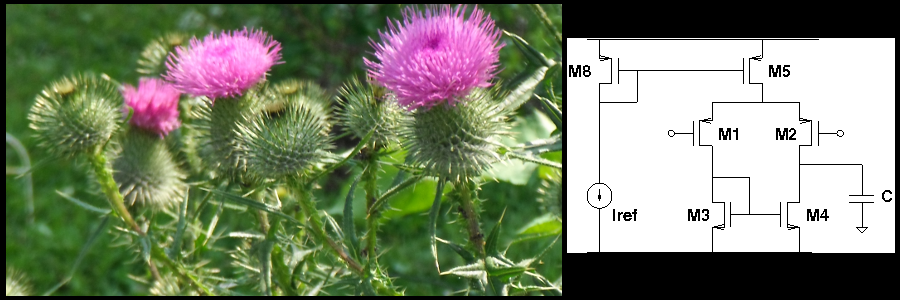

.. Cardoon documentation master file, created by
   sphinx-quickstart on Thu Nov  3 20:30:06 2011.
   You can adapt this file completely to your liking, but it should at least
   contain the root `toctree` directive.

Cardoon Electronic Circuit Simulator
====================================

User's Manual
-------------

.. toctree::
   :maxdepth: 2

   intro
   usage
   catalogs
   examples/examples

Developer's Manual
------------------

.. toctree::
   :maxdepth: 2

   coding
   testing
   adding_devices
   circuit_ref
   analysis
   analyses_classes
   design
   references   

Indices and tables
==================

* :ref:`genindex`
* :ref:`modindex`
* :ref:`search`

